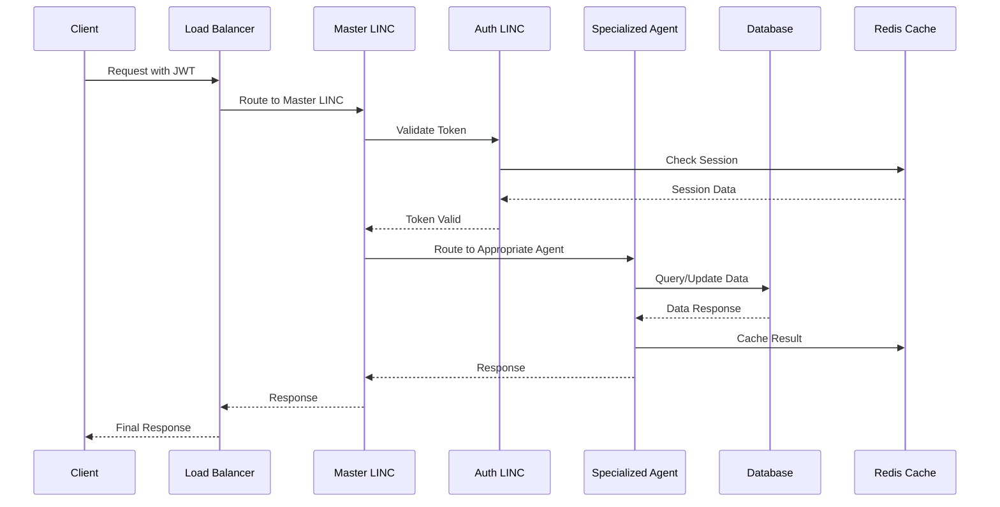
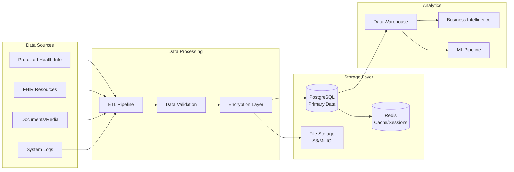
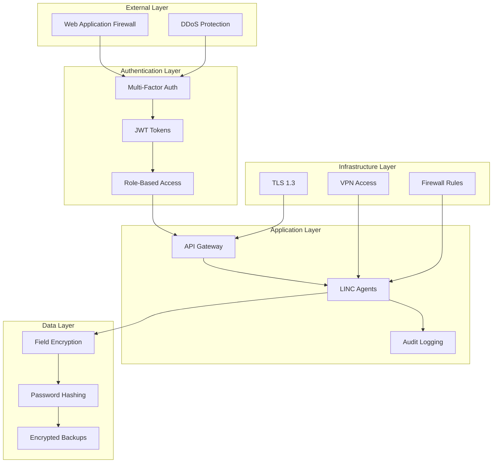
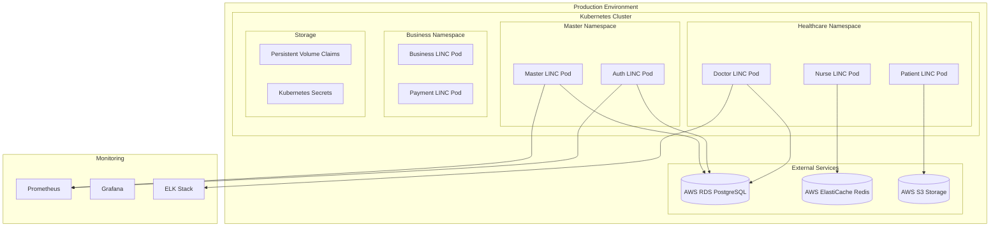
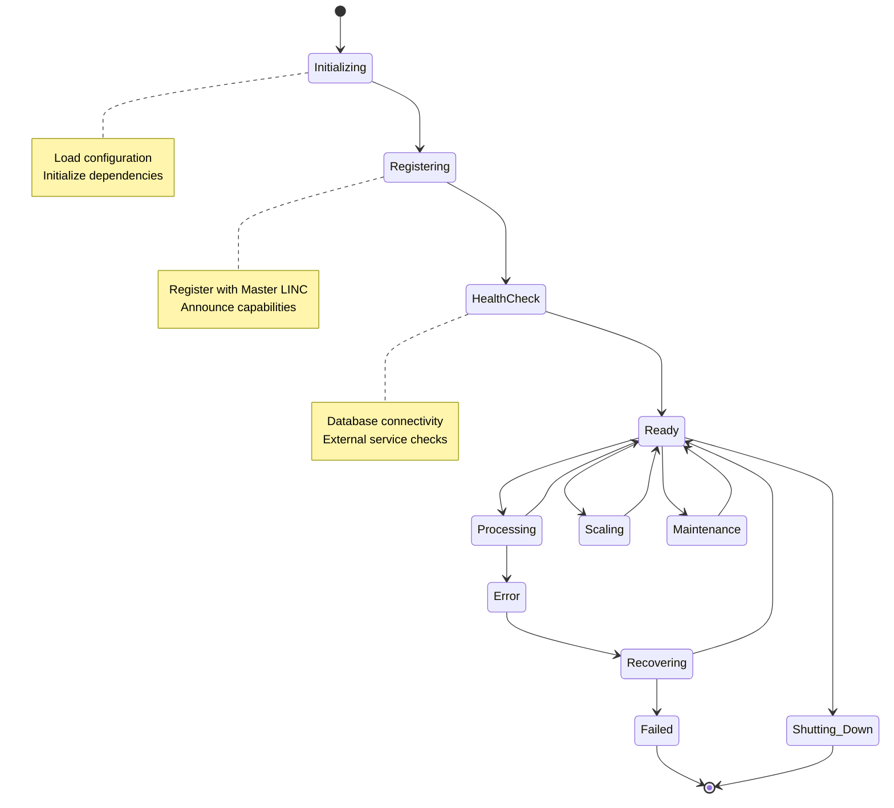

# BrainSAIT LINC Agent System Diagrams

## High-Level System Architecture

```mermaid
graph TB
    subgraph "External Systems"
        EXT1[Saudi MOH API]
        EXT2[NPHIES Platform]
        EXT3[Hospital HIS/EHR]
        EXT4[Third-party APIs]
    end

    subgraph "Load Balancer"
        LB[Nginx/HAProxy]
    end

    subgraph "Core Infrastructure"
        MASTER[Master LINC<br/>Port: 8000]
        AUTH[Auth LINC<br/>Port: 8001]
        DB[(PostgreSQL)]
        CACHE[(Redis)]
        MQ[Message Queue]
    end

    subgraph "Healthcare Agents"
        DOC[Doctor LINC<br/>Port: 8010]
        NURSE[Nurse LINC<br/>Port: 8011]
        PATIENT[Patient LINC<br/>Port: 8012]
        CARE[CareTeam LINC<br/>Port: 8013]
    end

    subgraph "Business Agents"
        BIZ[Business LINC<br/>Port: 8020]
        PAY[Payment LINC<br/>Port: 8021]
        INSIGHT[Insight LINC<br/>Port: 8022]
    end

    subgraph "Development Agents"
        DEV[Dev LINC<br/>Port: 8030]
        AUTO[Auto LINC<br/>Port: 8031]
        CODE[Code LINC<br/>Port: 8032]
    end

    subgraph "Content Agents"
        MEDIA[Media LINC<br/>Port: 8040]
        EDU[Education LINC<br/>Port: 8041]
        CHAT[Chat LINC<br/>Port: 8042]
    end

    subgraph "Identity Agent"
        OID[OpenID LINC<br/>Port: 8050]
    end

    subgraph "Web Interface"
        UI[Web UI<br/>Vite/Alpine.js]
        API[REST/GraphQL APIs]
    end

    subgraph "Mobile Apps"
        MOBILE[Mobile Apps<br/>React Native/Flutter]
    end

    EXT1 & EXT2 & EXT3 & EXT4 --> LB
    UI & MOBILE --> LB
    LB --> MASTER
    
    MASTER --> AUTH
    MASTER --> DOC & NURSE & PATIENT & CARE
    MASTER --> BIZ & PAY & INSIGHT
    MASTER --> DEV & AUTO & CODE
    MASTER --> MEDIA & EDU & CHAT
    MASTER --> OID

    AUTH --> DB
    DOC & NURSE & PATIENT & CARE --> DB
    BIZ & PAY & INSIGHT --> DB
    DEV & AUTO & CODE --> DB
    MEDIA & EDU & CHAT --> DB
    OID --> DB

    MASTER --> MQ
    DOC & NURSE & PATIENT & CARE --> MQ
    BIZ & PAY & INSIGHT --> MQ
    DEV & AUTO & CODE --> MQ
    MEDIA & EDU & CHAT --> MQ

    MASTER --> CACHE
    AUTH --> CACHE
    DOC & NURSE & PATIENT & CARE --> CACHE
```

## Agent Communication Flow

## Data Flow Architecture

## Security Architecture

## Deployment Architecture

## Agent Lifecycle Management

